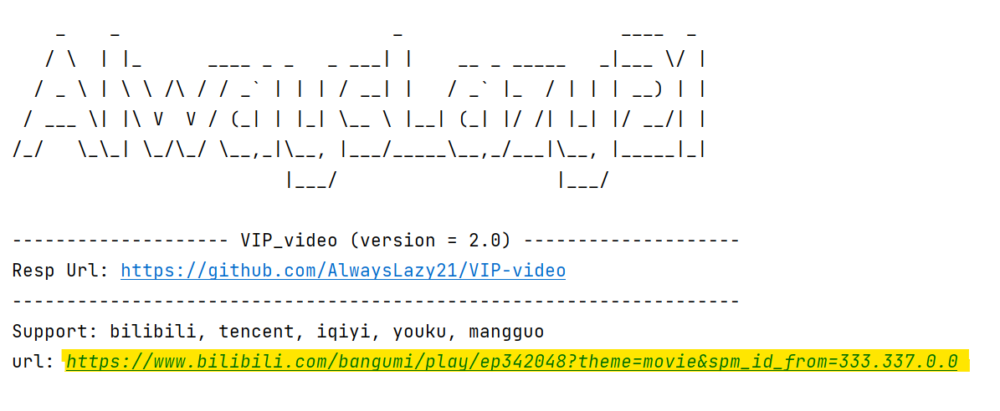

## 视频网站会员视频解析

---

### 使用方法

> 运行**VIP_video.**（或**VIP_video.py**）文件，只需输入需要解析的会员视频的**网址**（url）即可。   
> 该程序会自动调用系统的默认浏览器打开所有的解析网页，请自行选择合适的网页进行观看。

### 运行页面

为了更好的演示效果，测试图使用PyCharm进行演示

上面 **黄色荧光处** 的地方为自行填入的视频网站的链接。

### 最终效果

上边页面中的页面均为解析的网页，请自行选择观看

### 支持

- 该项目源文件为了更好的兼容性，源文件均使用英文进行开发。
- 如果你在使用的过程中，需要反馈，欢迎联系作者。
- 注：项目的所有解析网站俱来源自网络，如有侵权，请联系删除。
